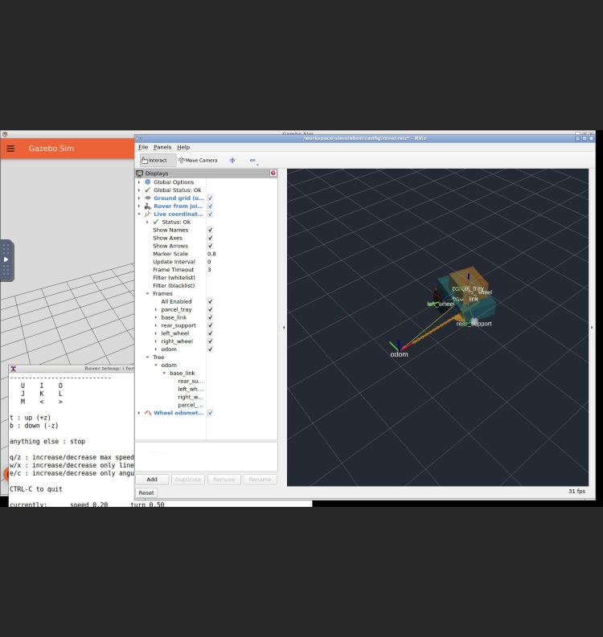

# Milestone 3 evidence — 2026-09-25

Local, unpublished evidence for teleoperation, wheel-only odometry, TF2 and RViz.
No sensor, navigation, firmware safety or real-hardware reliability claim is made.

| Check | Result and evidence |
| --- | --- |
| M1 baseline before implementation | [PASS: 101 clock messages](../milestone-1/20260925T185759Z-59476/result.json) |
| M2 baseline before implementation | [PASS: three identical fresh starts](../milestone-2/20260925T185803Z-acceptance-59475/result.json), [separate spawn/duplicate guard](../milestone-2/20260925T185803Z-acceptance-59475/spawn-check/result.json) |
| Container-only dependencies | [Successful image build](build.log) |
| M1 regression on rebuilt image | [PASS](../milestone-1/20260925T190822Z-60584/result.json) |
| M2 regression on rebuilt image | [PASS](../milestone-2/20260925T190828Z-acceptance-60583/result.json), [duplicate guard](../milestone-2/20260925T190828Z-acceptance-60583/spawn-check/result.json) |
| Analytic wheel integration | [Five tests PASS](20260925T191023Z-acceptance-60960/unit.log): straight/reverse, offset turn, arc, bad/stale timestamps, stationary |
| Final fresh headless ROS/Gazebo acceptance | [PASS](20260925T191023Z-acceptance-60960/result.json): 601 odometry messages at 50 Hz; forward, reverse, left, right, arc, explicit zero |
| Live TF correctness and authority | [Recorded frame tree](20260925T191023Z-acceptance-60960/frames.yaml); result above checks frame origins, wheel rotation, same-stamp odom/TF, publishers and subscriptions |
| Final desktop startup | [Live readiness PASS](20260925T190959Z-launch-60871/readiness.json), [ROS/RViz logs](20260925T190959Z-launch-60871/ros.log) |
| Actual browser keyboard input | [PASS: i then k](20260925T190959Z-launch-60871/keyboard.json); 0.2 m/s then zero, 0.413 m observed odometry displacement, final zero speed |
| Full route with Gazebo GUI and RViz running | [PASS](20260925T190959Z-launch-60871/desktop-check/result.json) |
| Actual browser-visible RViz | [Screenshot](20260925T190959Z-launch-60871/rviz-browser.png): model, TF frame labels/tree, odometry trail and global/TF OK |
| Final inspected RViz settings and source audit | [Final source hashes](20260925T190959Z-launch-60871/final-source-sha256.json), [Compose state](20260925T190959Z-launch-60871/compose-state.json), [static checks](static-checks.log) |

## What the measurements establish

The final headless route's maximum difference from test-only Gazebo pose is
**0.02615 m position and 0.17542 rad heading (about 10.1 degrees)**. The final
desktop route is **0.02625 m / 0.17571 rad**. Both pass the explicit nominal budgets
of 0.10 m / 0.20 rad. These are bounded checks for this short route and recorded
image, not a calibrated accuracy model. The measured heading drift remains visible
and is not corrected using simulator truth. A future localization layer is needed.

The only odometry subscriptions are `/clock` and `/joint_states`. There is exactly
one `/odom` publisher. Dynamic TF publishers are `wheel_odometry` and
`robot_state_publisher`. The complete tree has five edges: `odom -> base_link`,
then `base_link -> left_wheel/right_wheel/rear_support/parcel_tray`. Static edges
have zero timestamps by ROS convention; they are valid for all times. There is
no `map` frame and no simulator-pose bridge. The test uses direct Gazebo Transport
pose observations solely in its own process.

Each runtime directory contains the generated URDF/SDF, validation, spawn and
scene evidence, package versions and process logs. Final headless runtime source
hashes are in `20260925T191023Z-acceptance-60960/runtime/source-sha256.json`.
The final desktop snapshot additionally records the manual keyboard observer and
RViz panel-layout changes saved through the GUI after startup. Those layout
changes affect presentation only; the screenshot records the resulting live view.

## Failures and fixes retained

1. `20260925T190542Z-acceptance-60192` failed the initial 0.08 rad heading budget
   during the left turn: measured disagreement was 0.12790 rad while translation
   differed by 0.01417 m. Analytic wheel integration passed. This demonstrates the
   rolling-model/physics mismatch; finite-width contact/slip is the likely cause,
   not isolated conclusively by these tests. The nominal budget was explicitly
   revised to 0.20 rad / 0.10 m, with independent physical direction and minimum
   displacement assertions added. No truth correction or fitted wheel geometry
   was introduced. The full route's observed drift is reported above.
2. `20260925T190708Z-acceptance-60352` exposed an acceptance startup race: the test
   waited for a wheel TF but queried the tray before static TF discovery completed.
   It now waits for all five required paths before taking a sample. Both final
   headless and desktop checks passed with this fix.
3. The first RViz config used flat arrow-size keys. RViz showed default large red
   arrows. Saving the inspected GUI config exposed its nested `Shape` schema;
   the final config uses short amber arrows, larger TF markers and translucent
   robot visuals so the frames remain visible. Screenshot is a real browser
   capture, not an illustration.
4. xterm's default bitmap font was missing. Selecting installed scalable
   `monospace` fixed the terminal without another host or system installation.

ROS logs retain the KDL root-inertia warning: robot_state_publisher does not use
root mass for these kinematic transforms, while Gazebo retains and validates the
URDF inertia for physics. OpenGL stereo and Gazebo antialiasing warnings reflect
the CPU-rendered desktop. They did not prevent the observed displays or tests.

Run commands and thresholds: [setup guide](../../docs/setup.md).
Frame and hardware limitations: [concept note](../../docs/concepts/teleop-tf-odometry.md).
Decision: [ADR 0003](../../docs/decisions/0003-wheel-feedback-and-tf.md).
