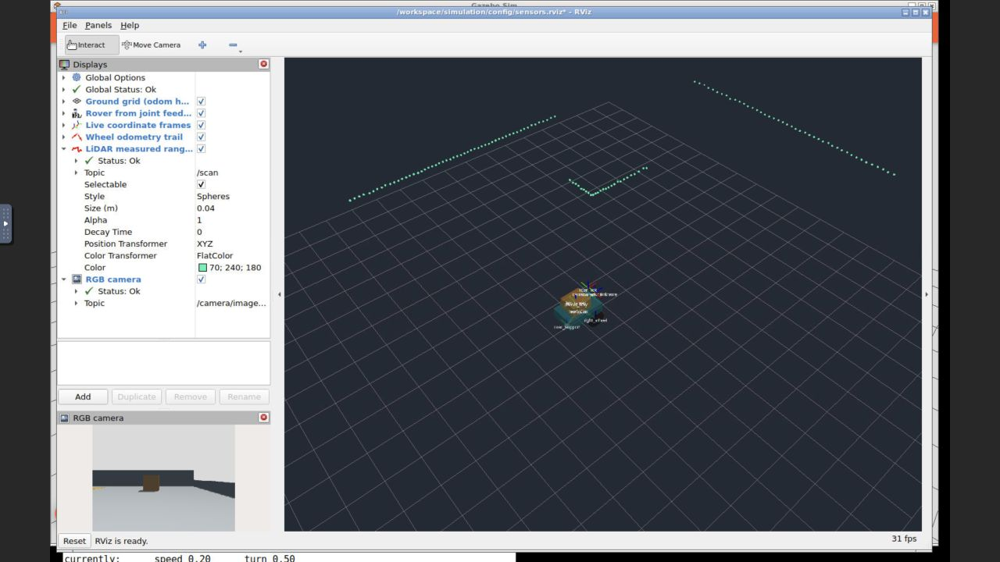

# Milestone 4 evidence — 2026-09-25

Local, unpublished evidence for simulated LiDAR, RGB camera, raw IMU and explicit
wheel-encoder interfaces. Only M4 was implemented. No real-hardware reliability,
localization, navigation, perception or low-level safety claim is made.

| Check | Result / evidence |
| --- | --- |
| M1 baseline before changes | [PASS, 101 clock samples](../milestone-1/20260925T193238Z-62607/result.json) |
| M2 baseline before changes | [PASS, three identical starts](../milestone-2/20260925T193244Z-acceptance-62657/result.json) |
| M3 baseline before changes | [PASS, motion/TF/50 Hz odometry](../milestone-3/20260925T193319Z-acceptance-62606/result.json) |
| Container-only build | [PASS](build.log); small ROS message package compiled inside both images |
| M1 regression on rebuilt image | [PASS](../milestone-1/20260925T194135Z-63460/result.json) |
| M2 regression | [PASS](../milestone-2/20260925T194357Z-acceptance-63966/result.json) |
| M3 regression | [PASS](../milestone-3/20260925T194434Z-acceptance-63965/result.json); existing odometry source [unchanged](odometry-source-audit.json) |
| Encoder analytic checks | [3 tests PASS](20260925T194706Z-acceptance-65403/unit.log): signed revolutions/origin, half-count error bound, invalid sample |
| Final fresh M4 acceptance | [PASS](20260925T194706Z-acceptance-65403/result.json): all streams, frame/time/rate/geometry/noise contracts and signed encoder motion |
| Actual TF tree | [Nine edges](20260925T194706Z-acceptance-65403/frames.yaml); optical-axis rotation checked |
| Recording | [MCAP metadata](20260925T194706Z-acceptance-65403/sensors-bag/metadata.yaml), [bag summary](20260925T194706Z-acceptance-65403/bag-info.txt), [recording](20260925T194706Z-acceptance-65403/sensors-bag/sensors-bag_0.mcap) |
| Actual isolated replay | [PASS](20260925T194706Z-acceptance-65403/replay-result.json): 100% of recorded sensor messages received with unchanged decoded fields and image bytes; sensor TF resolves |
| Final GUI sensor acceptance | [PASS](20260925T194850Z-launch-66034/readiness/result.json), [final source manifest](20260925T194850Z-launch-66034/final-source-sha256.json) |
| Actual RViz visualization | [Browser screenshot](20260925T194850Z-launch-66034/rviz-browser.jpg): Global, LiDAR and RGB status OK; scan and RGB visible |
| Numerical inspection | [IMU](20260925T194521Z-launch-64304/imu-sample.yaml), [encoder](20260925T194521Z-launch-64304/encoder-sample.yaml), [calibration](20260925T194521Z-launch-64304/camera-info-sample.yaml) |

## What passed

Final live rates measured over acquisition stamps were 10.035 Hz scan, 10.035 Hz
image/calibration, 94.379 Hz IMU and 49.517 Hz encoders. Startup discovery contributes
gaps to this whole-run statistic; the desktop stationary window measured exactly
100 Hz IMU and 50 Hz encoders. These are simulation rates, not CPU wall-time rates.
Best-effort streams are allowed 80–110% of configured rates in this short check.

The east wall measured 6.2371 m against nominal 6.24 m, with 9.36 mm sample standard
deviation against configured 10 mm noise. The north wall and table occlusion
checks passed; the ray over the low crate reached the wall. Camera calibration
matched the 60° pinhole model with 30 paired image/info observations. The stationary
IMU measured z acceleration 9.8387 m/s² (expected 9.81 + .03 bias), z gyro .002904
rad/s (expected .003 bias), and gyro standard deviation .002005 rad/s (σ=.002).

Forward/reverse counts were +558/+558 and -558/-558. A left turn produced -268/+268.
514 encoder samples matched joint-angle acquisition stamps and the half-count
quantization bound. The gyro also observed physical angular motion during the turn.
No world pose/native odometry topic or map frame appeared in ROS, and the original
wheel-odometry subscription boundary remained unchanged.

The final bag is about six simulation seconds. Replay received all 587 IMU,
293 encoder, 59 RGB, 59 CameraInfo and 58 scan messages, with unchanged semantic
payloads and timestamps. Static TF and robot description are present. Replay ran
in an isolated container in ROS domain 43, with no simulator or sensor drivers.

Native rendering/transport ages reached about 206 ms in the final headless run.
A 10 ms modeled delay is not an end-to-end latency guarantee. Independent ROS clock
callbacks can make observed age a few milliseconds below that modeled delay.
The implementation releases queued IMU/encoder samples only after its own ROS
simulation clock reaches acquisition +10 ms. These are simple uncalibrated models.

## Retained failures and fixes

1. [Build-context failure](build-context-failure.log): existing `.dockerignore`
   admitted only Dockerfile. Added narrow exceptions for the message package and
   entrypoint; rebuilt successfully. No host software installed.
2. `20260925T193938Z-acceptance-63297`: camera focal lengths differed by ~9.5e-6 px.
   Replaced exact floating-point equality with a .01 px tolerance, retaining an
   independent .1 px check against the theoretical focal length.
3. `20260925T194133Z-acceptance-63445`: ROS defaults a new Quaternion to identity.
   The driver already marked orientation unavailable, but now explicitly zeros
   the placeholder too. Acceptance checks both properties.
4. M2 regression `20260925T194140Z-acceptance-63516` timed out during world-control stepping under concurrent
   CPU-rendered simulation load. Retained its log; the isolated rerun above passed
   with the same model and deterministic poses. Resource contention is the likely
   cause, not conclusively isolated. No stepping retry or timeout relaxation added.
5. `20260925T194315Z-acceptance-63789/replay.log`: hashing reserialized CDR bytes
   was sensitive to padding. Compare all decoded fields plus image bytes instead.
   The first field comparison was too slow with large image integer arrays and a
   five-message receive queue: only 308/582 IMU samples reached the verifier.
   [Failure retained](20260925T194315Z-acceptance-63789/replay-queue-failure.json).
   Hash RGB bytes directly and use a bounded 1000-message verifier queue. Replay
   then delivered every sample; a full fresh run passed with the final verifier.

Generated URDF/SDF, generated M4 world, launch commands, source hashes, package
manifests and component logs are retained in each runtime directory. The original
browser screenshot records interactive panel sizing; subsequent default settings
expand sensor statuses automatically. Known KDL root-inertia, `gz_frame_id`
extension and software-rendering warnings are retained; actual message and visual
checks passed. See [setup](../../docs/setup.md), [concepts](../../docs/concepts/sensors.md)
and [ADR 0004](../../docs/decisions/0004-sensor-contracts-and-simulation-boundary.md).
