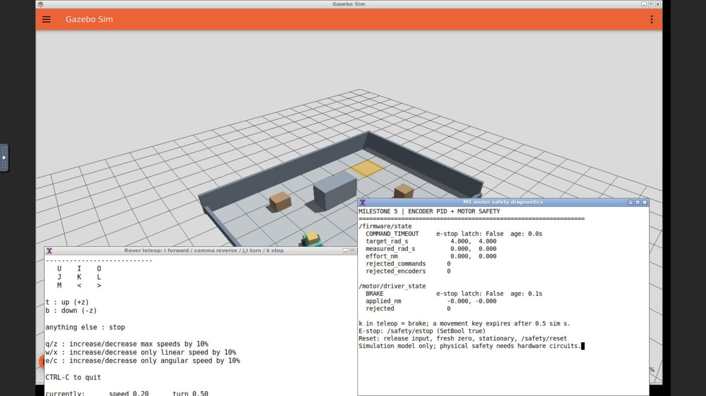

# Milestone 5 evidence — 2026-09-25

Verified simulation-only firmware and motor safety. The controller consumes stamped
body-velocity intent and delayed/quantized encoder counts, applies wheel PID and
limits, and sends bounded torque to a separate Gazebo motor driver. No mapping,
localization, Nav2 or perception is included; Gazebo pose stays test-only.

| Check | Evidence / result |
| --- | --- |
| M1–M4 before implementation | [M1](regressions/before/m1/result.json), [M2](regressions/before/m2/result.json), [M3](regressions/before/m3/result.json), [M4](regressions/before/m4/result.json), [isolated replay](regressions/before/m4/replay-result.json): PASS |
| Container image build | [Build log](build.log): compiled motor driver for both images; no host installation |
| M1–M4 on rebuilt image | [M1](regressions/after/m1/result.json), [M2](regressions/after/m2/result.json), [M3](regressions/after/m3/result.json), [M4](regressions/after/m4/result.json), [isolated replay](regressions/after/m4/replay-result.json): PASS |
| Deterministic firmware core | [Nine tests PASS](acceptance/unit.log): quantized plant, feedback response, zero braking, limits/anti-windup, command/feedback expiry, latch/reset and invalid input |
| Final fresh headless acceptance | [19 checks PASS](acceptance/result.json), [control trace](acceptance/control-trace.json) |
| Physical command timeout | Observed 0.538 simulation seconds after streaming phase ended; 0.39045 m subsequent travel from maximum wheel request; 0.032 mm further travel in settled half-second window |
| Physical e-stop | 0.02813 m travel after assertion from nominal 0.2 m/s case; subsequent commands could not clear either latch |
| Driver independence | Frozen firmware: WATCHDOG observed in 0.194 simulation seconds; [state and wheel stopping](acceptance/result.json) |
| Encoder loss | Suspended actual sensor process while continuing commands: ENCODER_TIMEOUT, physical stop; fresh feedback/new commands recover |
| Driver protocol | Sub-deadband efforts produce zero torque; stale, malformed and over-limit frames brake and increment rejection counter |
| Reset | Refused while asserted and without fresh zero; release + fresh zero + stationary feedback succeeds; no old command replay; subsequent new request moves |
| Graph/model boundary | [Generated SDF](acceptance/runtime/rover.sdf): one MotorDriver, no DiffDrive. Firmware inputs exactly clock, stamped cmd_vel and encoders |
| Visible desktop acceptance | [PASS](desktop-acceptance/result.json), [trace](desktop-acceptance/control-trace.json); physical motion, command faults, timeout and e-stop/reset |
| Actual browser | [Timeout/brake](desktop-timeout.png), [both e-stop latches](desktop-estop.png); Gazebo and read-only motor monitor |
| Documented CLI | [Stamped request](cli-stamped-command.log) and [e-stop service response](cli-estop.log); [firmware](estop-state.yaml), [driver](estop-driver.yaml) |

## Measurements and interpretation

The final headless forward wheel mean was 1.4364 rad/s against 1.4286 requested;
reverse was -1.4085 against -1.4286; turning was -0.8437/+0.8309 against
-0.8571/+0.8571. Averages cover the final 0.6 s of each motion segment. Individual
encoder estimates are quantized in approximately 0.1534 rad/s steps at 50 Hz.
The turn physically changed heading by about 1.26 rad. These checks exercise the
actual effort-driven physics, not DiffDrive's ideal velocity setting.

A 100 m/s input was scaled to 4 rad/s wheel targets; live effort remained below
2 N m and requested ramps obeyed 4 rad/s². The deterministic locked-wheel test
actually reaches torque saturation and verifies bounded integral action. Live
nominal motion need not hit the torque ceiling to demonstrate speed saturation.

Physical safety checks require less than 5 mm displacement over a settled 0.5 s
window and wheel speed below 0.1 rad/s. Timeout travel must be below 0.5 m for the
maximum-request test; e-stop travel below 0.12 m for the nominal-speed test. Both
passed. Timeout includes the deliberately allowed command lease plus braking
lag. The braking model is finite damping torque, not an instantaneous joint or
pose reset, and these numbers are not real-hardware stopping guarantees.

The GUI run may stop sooner in simulation time because its 1-second monotonic
command deadline can expire before 0.5 simulation seconds under CPU rendering
load. Its observed post-stream interval was 0.233 simulation seconds. Both time
bases are intentional. The CLI check also encountered a clock-progress stall and
correctly inhibited before the explicit e-stop; the desktop log retains that
transition. No source is allowed to renew a motor lease using unchanged sim time.

During firmware suspension its last ROS state remains ACTIVE but becomes stale;
the independently published driver state becomes WATCHDOG and wheel speed falls
to near zero. During direct native fault injection the driver rejection count
increases; after firmware resumes, an old queued frame can add another rejection.
This is observable safe rejection, not an unexplained nominal-path failure.

## Resolved engineering observations

[Curated diagnostic samples](resolved-observations.json) retain the initial turn's
integral clamp and a feedback-recovery issue. Tire scrub needed more integral
authority, so Ki became 0.8 and the integral limit 1.2 N m. Final turn error is
below 0.03 rad/s with the tighter 0.15 rad/s acceptance tolerance. A test publisher
was corrected to avoid duplicate timestamps between phases; nominal final motion
has zero rejected commands. The receiver now handles skipped encoder deliveries
using cumulative counts and the longer acquisition interval; process-suspension
recovery passes. No failing implementation is marked complete.

## Provenance and scope

`acceptance/` is a curated copy of the final fresh headless run
`20260925T201133Z-acceptance-71872`. Runtime logs, model/world, image identity,
package list, launch commands and original source manifest are included.
[Original regression paths](regressions/original-runs.json) identify local raw runs;
curated result snapshots are linked above. The M4 sensor bags were actually
recorded and replayed in both baseline/regression runs; repeated bags are not
republished in M5 evidence.

After the final headless scenario, two additional pure tests and the read-only
GUI monitor were added. Nine core tests passed, and desktop acceptance passed with
the monitor. The controller core, ROS firmware and C++ motor source stayed unchanged.
[Final source manifest](final-source-sha256.json) and [desktop launch snapshot](desktop-runtime/)
identify those additions separately from the original headless manifest. Captured
terminal logs normalize line endings/trailing whitespace without altering messages.
Timestamped raw runs remain local and ignored; curated evidence is committed.

The desktop is left stopped with e-stop asserted in both layers. The simulator
continues publishing sensor/diagnostic state for inspection. See
[setup/reset](../../docs/setup.md#milestone-5-simulated-firmware-and-motor-safety),
[full controller contracts/hardware gaps](../../docs/concepts/firmware-safety.md),
and [ADR 0005](../../docs/decisions/0005-encoder-pid-and-independent-motor-watchdog.md).
