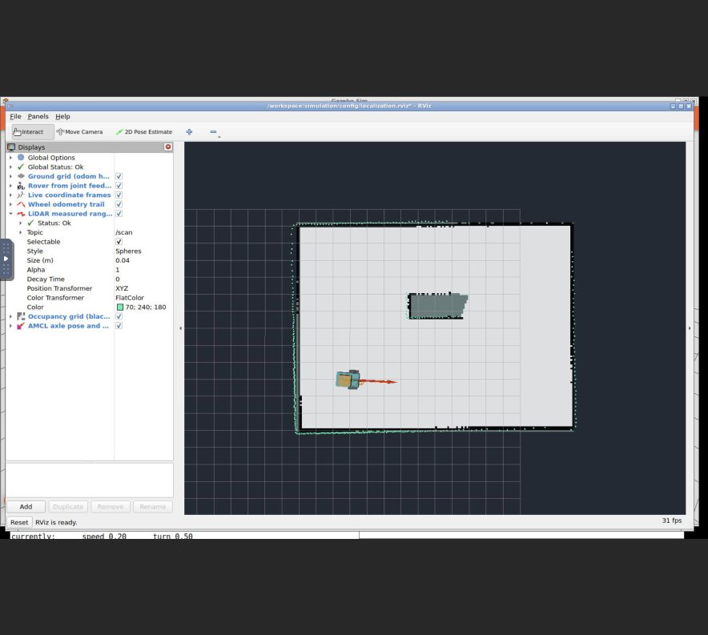
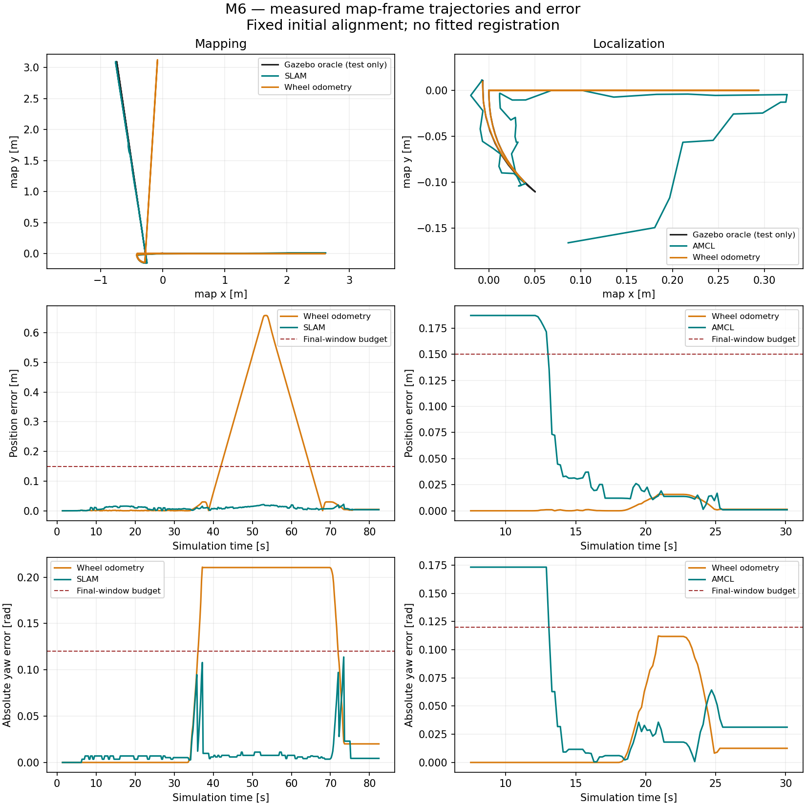

# Milestone 6 evidence — 2026-09-25/26

SLAM Toolbox builds an occupancy grid from the existing noisy LiDAR and wheel
odometry. A separate AMCL/map-server process localizes against the saved map after
a fresh simulator/odometry restart and an approximate operator prior. Every
movement passes through M5 firmware and the independent motor driver. Gazebo pose
and room geometry are used exclusively by acceptance tests.

| Check | Evidence / result |
| --- | --- |
| M1–M5 before implementation | [M1](regressions/before/m1/result.json), [M2](regressions/before/m2/result.json), [M3](regressions/before/m3/result.json), [M4](regressions/before/m4/result.json), [M5](regressions/before/m5/result.json): PASS |
| M1–M5 after final model/frame change | [M1](regressions/after/m1/result.json), [M2](regressions/after/m2/result.json), [M3](regressions/after/m3/result.json), [M4](regressions/after/m4/result.json), [M5](regressions/after/m5/result.json): PASS; M4 isolated bag replay also passed before/after |
| Container build | [Build log](build.log), [headless image](acceptance/image.txt); ROS Jazzy SLAM Toolbox 2.8.5 and Nav2 localization 1.3.13 |
| Offline contracts | [Five tests](acceptance/final-unit.log): runtime helper input boundaries, explicit AMCL prior, unknown-cell preservation, rejection of empty/displaced maps |
| Fresh mapping | [PASS](acceptance/mapping/result.json), [generated room/model](acceptance/mapping/runtime/), [finite survey](acceptance/mapping/survey.json) |
| Saved map | [Versioned PGM/YAML and preview](../../maps/delivery_room_v1/README.md), [hashes/provenance](../../maps/delivery_room_v1/provenance.json) |
| Fresh headless localization | [PASS](acceptance/localization/result.json): no map TF before prior; immutable saved grid; 35 AMCL updates; sustained convergence and physical stop |
| Transform ownership | [Mapping GIDs](acceptance/mapping/tf-authorities.tsv), [localization GIDs](acceptance/localization/tf-authorities.tsv); resolved authorities and input audits in each result |
| Recorded measurements | [Mapping MCAP](acceptance/mapping/bag/), [localization MCAP](acceptance/localization/bag/); map, scan, odometry, TF, commands and safety telemetry; localization includes the one-shot prior and AMCL estimates |
| Final fresh desktop localization | [PASS](desktop-acceptance/result.json), [runtime](desktop-runtime/): 0.01015 m / 0.02103 rad final-window error; all retained bag topics present |
| Bag readback | [All 167,852 messages deserialized](bag-readback.json), counts match metadata in all three MCAP bags |
| Actual RViz | [Local browser screenshot](rviz-localization.png): map, measured scan, rover, AMCL pose, healthy global TF status |

## Map quality

The saved grid is **160 × 121 cells at 5 cm/cell**: 1,003 occupied, 17,657 free,
and 700 unknown cells. Unknown grey survives PGM/YAML reload and map-server
publication. Occupied-cell centres have **4.34 cm RMS** and **9.80 cm 95th-percentile**
distance to the nearest actual wall/table surface at laser height. Each of the
four room boundaries has 100% sampled coverage within 15 cm. Known interior is
99.95%, measured inside a 10 cm wall inset and excluding a 10 cm buffer around
the solid table. These exclusions and thresholds are explicit in
[the quality oracle](../../tests/map_quality.py).

The table's east face has only **28.6%** coverage within 15 cm; its north face has
87.1%. Mapping observes the room boundaries well but does not reconstruct every
occluded surface. Low crates and painted pads are invisible to this laser slice.
The M6 world raises only the original two 0.30 m cutaway walls to 0.80 m so they
intersect the unchanged approximately 0.58 m-high laser plane. The historical
M1–M5 world remains unchanged. This is not a collision-clearance map.

The test uses the fixed initial relation `world_xy = map_xy + (-2.5, -1.5)`,
zero yaw. No fitted alignment removes map distortion. Geometry is never converted
into the map: SLAM Toolbox alone generates it from scans and wheel TF.

## Pose accuracy and convergence

The operator prior is `(0.25, -0.20, 0.20 rad)` for the axle frame `base_drive`,
with standard deviations `(0.25 m, 0.25 m, 0.30 rad)`. It deliberately differs from
the approximate actual starting axle pose `(0.14, 0, 0)`. Reported trajectory
errors use chassis `base_link` in `map`, with Gazebo samples matched within 15 ms.

| Measurement | Mapping | Headless localization |
| --- | ---: | ---: |
| Position RMS over recorded trajectory | 0.0103 m | 0.0948 m |
| Final ten-sample maximum position error | 0.00372 m | 0.00096 m |
| Final ten-sample maximum yaw error | 0.00439 rad | 0.03128 rad |
| Final position/yaw acceptance limits | <0.15 m / <0.12 rad | <0.15 m / <0.12 rad |

Localization's larger trajectory RMS includes the intentionally wrong initial
prior and its correction. The first ten-sample window meeting pose limits spans
simulation time 13.1–14.9 s. Final x/y/yaw variances are
`[0.00269 m², 0.000770 m², 0.00144 rad²]`, below the unchanged
`[0.04, 0.04, 0.0225]` limits. Sub-centimetre nominal results are observations of
this simulation, not hardware accuracy claims or statistical reliability bounds.

Wheel-only position error reaches 0.658 m during the mapping survey, while the
scan-corrected estimate remains within 0.022 m. Loop closure is enabled and the
survey revisits earlier views, but no accepted-loop count or loop-closure ablation
was recorded. These results establish scan-based correction, not a quantified
loop-closure benefit. AMCL convergence from this nearby prior does not establish
global or kidnapped-robot relocalization in ambiguous rooms.

The independent desktop restart has final x/y/yaw variances
`[0.00264 m², 0.000758 m², 0.00198 rad²]`; all 35 AMCL updates, the initial
pose and retained map are present in its [MCAP bag](desktop-acceptance/bag/).

## Input, TF and safety boundaries

The received-message publisher GID audit identifies only `slam_toolbox` or `amcl`
as `map -> odom` owner, depending on mode. `wheel_odometry` alone owns
`odom -> base_link`; robot-state-publisher owns link extrinsics. There is no static
map transform and no Gazebo/world pose topic bridged into ROS. Estimator and
internal TF-listener subscriptions are checked against narrow allowlists.
The read-only C++ probe publishes no TF or pose. The separate motion tape reads
only clock/firmware status; the initializer reads only clock. Neither imports
the test oracle or receives its output.

M5 is the only `/cmd_vel` actuator consumer; rosbag is a passive observer. The
actual generated model contains one MotorDriver and no DiffDrive plugin. Both
headless surveys ended in firmware `COMMAND_TIMEOUT`, driver `BRAKE`, effectively
zero wheel speeds, zero rejected commands and effort below 2 N m. Complete
watchdog, feedback-loss, e-stop/reset and frozen-controller checks remain covered
by the fresh M5 regressions. No planner, controller server, waypoint follower,
behavior tree, perception or ML was added.

## Resolved observations and provenance

AMCL initially used the chassis centre, 14 cm behind the axle. Turns then caused
large covariance spikes because its differential motion model expects the axle
rotation centre. The M6-only fixed `base_drive` frame corrects that mismatch;
noise and covariance acceptance limits were not reduced or relaxed.
[Retained diagnostic samples and passing correction](resolved-observations.json)
explain the resolved issue.

A desktop startup rejected one encoder sample and the survey correctly refused
motion. Its exact rejected-sample timing was not captured; a clean restart
completed with zero rejected encoders. No firmware threshold was weakened. A
subsequent recording missed the already-published static map despite successful
localization; explicit reliable/transient-local recorder QoS corrected that issue.
The final desktop acceptance passed all checks with a complete bag. These
observations are retained alongside the frame diagnostic above.

The initial dependency download failed with a 403/certificate hostname mismatch
at packages.ros.org. [Retained download log](resolved-package-download.log) and the
successful build identify the switch to the official repo.ros2.org archive with
TLS and the original signing key still enabled. No macOS packages were installed.

[Acceptance provenance](acceptance/provenance.json) identifies the two separate
fresh headless runs; the saved map has exactly the bytes loaded by localization.
Mapping passed before later helper/recorder readiness fixes. Explicit discovery
waits prevent an unresolved subscriber name from being mistaken for an actuator;
the initializer waits for AMCL rather than a recorder alone. The recorder waits
for the prior topic and uses explicit reliable/transient-local QoS for retained
map, robot-description and fixed-TF samples. Runtime estimator and M5 source
remain the same across those readiness changes.

The [final source manifest](final-source-sha256.json) identifies the committed
implementation and helper changes. The desktop remains running for inspection,
with the rover stationary and e-stop asserted in both layers
([service result](desktop-estop.log), [state](desktop-stopped.json)).

[Regression source paths](regressions/original-runs.json), package manifests,
launch commands and generated model/world accompany the curated results.
Timestamped raw runs and orchestration logs remain local and ignored. Curated
text logs normalize line endings/trailing whitespace without changing messages.
See [repeatable commands](../../docs/setup.md#milestone-6-mapping-and-localization),
[concepts/hardware limits](../../docs/concepts/mapping-localization.md), and
[ADR 0006](../../docs/decisions/0006-slam-toolbox-and-amcl.md).
