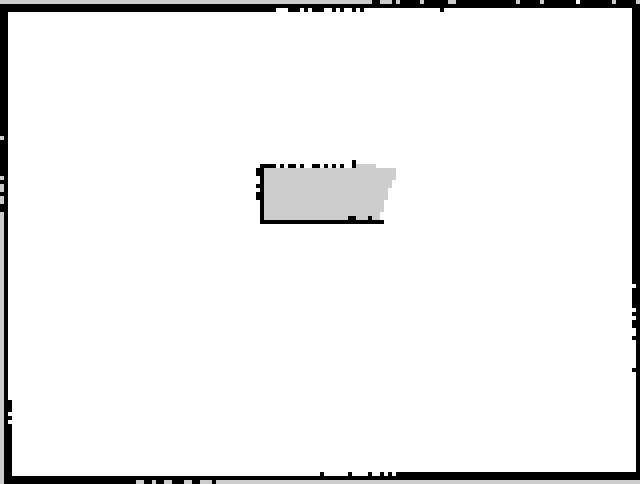

# Delivery room map v1

Generated from the existing noisy LiDAR and wheel-derived TF by SLAM Toolbox,
using the M6 room variant and M5 motion/safety path. No simulator pose or world
geometry was used to generate the map. [Provenance and hashes](provenance.json)
and [acceptance evidence](../../evidence/milestone-6/README.md) identify the run.

`map.yaml` + `map.pgm` are the localization artifact. `map.png` is a 4x nearest
neighbour preview, not a replacement input. Black is occupied, white is observed
free, grey is unknown. Resolution is 5 cm/cell. The map reference starts at the
mapping rover's initial `base_link` pose; the YAML origin locates the image's
lower-left corner in that reference. AMCL's operator pose is the `base_drive`
axle frame, 0.14 m ahead of the chassis centre.

The two low cutaway walls are raised to 0.8 m in M6. Crates remain below the
LiDAR plane and are absent. The eastern table face is only partially observed;
unknown cells remain unknown on save/reload. This is a laser-height occupancy
slice, not a clearance or safe-navigation map. No semantic labels are inferred.

Treat this version as immutable. `scripts/test-milestone-6.sh` saves a new
candidate inside each run directory; `scripts/save-map.sh` refuses an existing
PGM/YAML prefix. Create and verify a new version before replacing this map.
